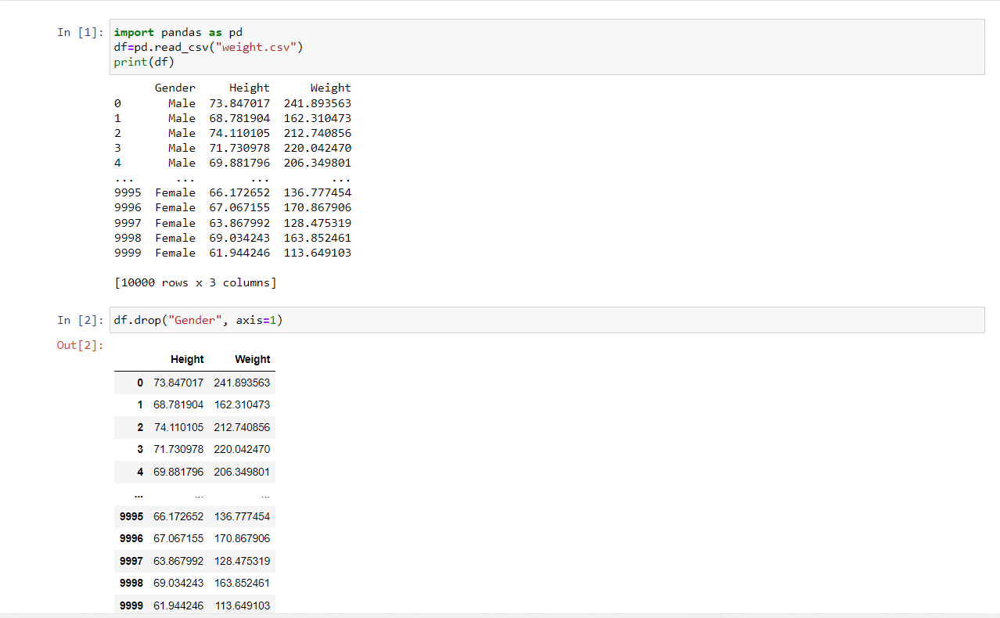
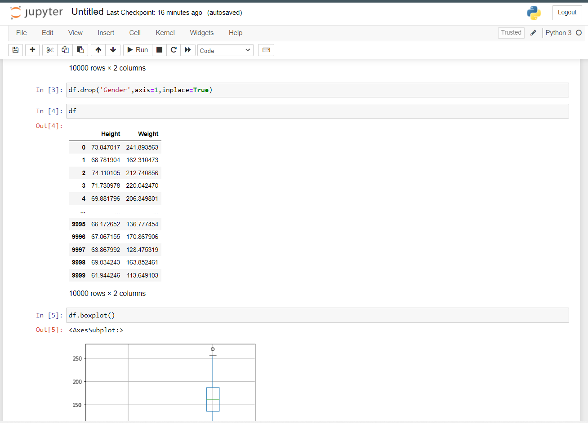
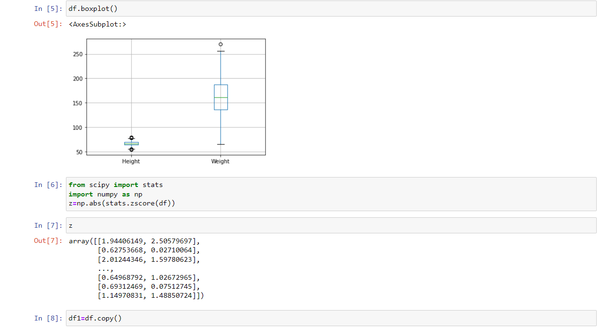
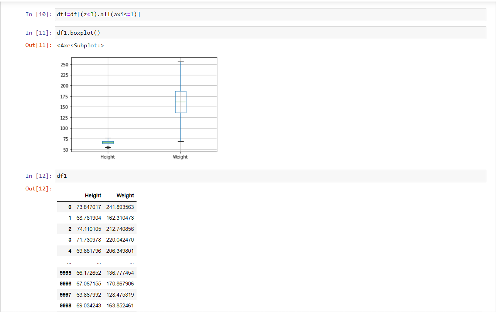
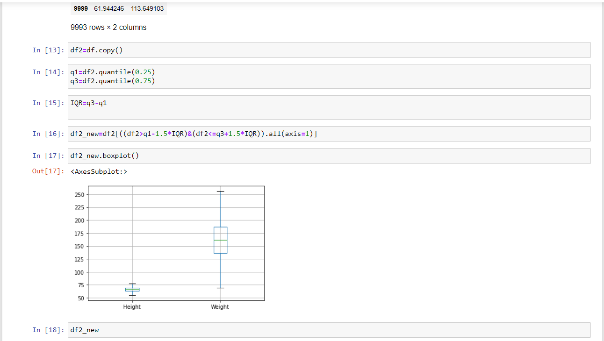
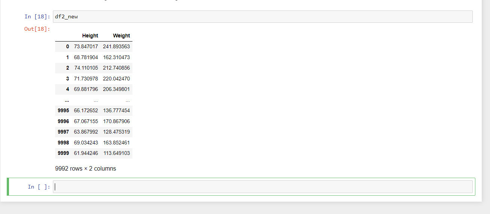

# Ex-02_DS_Outlier
## AIM :
To detect and remove the outliers available in the given csv file.

## ALGORITHM :
### Step 1:
Create a new folder in Jupyter Notebook.

### Step 2:
Upload the csv file and create a new python kernel.

### Step 3:
In the python kernel import the pandas and write to codes to remove the outliers.

### Step 4:
Use the quantile formulas and boxplot()to view the graph.

### Step 5:
End of Program.

## CODE :


```
import pandas as pd
df=pd.read_csv("weight.csv")
print(df)
df.drop("Gender", axis=1)
df
df.drop('Gender',axis=1,inplace=True)
df.boxplot()
from scipy import stats
import numpy as np
z=np.abs(stats.zscore(df))
df1=df.copy()
df1=df[(z<3).all(axis=1)]
df1.boxplot()
df2=df.copy()
q1=df2.quantile(0.25)
q3=df2.quantile(0.75)
IQR=q3-q1
df2_new=df2[((df2>=q1-1.5*IQR)&(df2<=q3+1.5*IQR)).all(axis=1)]
df2_new.boxplot()
df2_new
```
## OUTPUT :
i)

ii)

iii)

iv)

v)

vi)


## RESULT :
Thus the given outliers in the given csv file has been removed.
